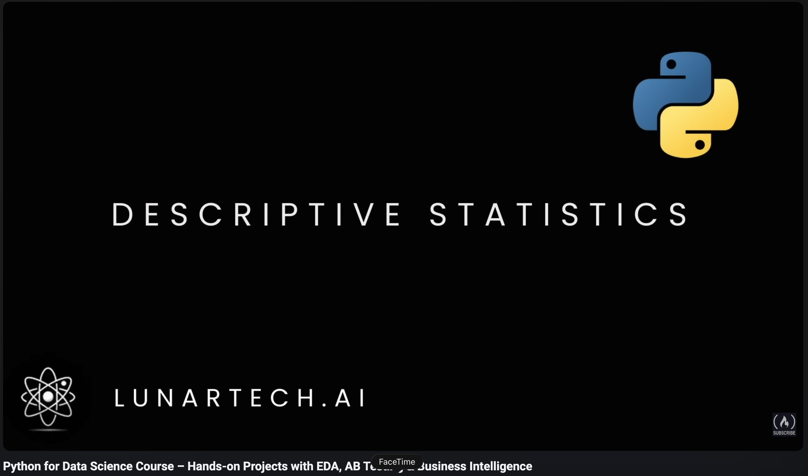
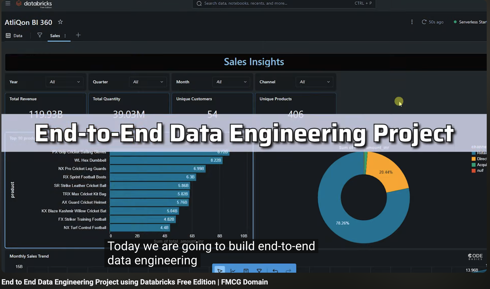
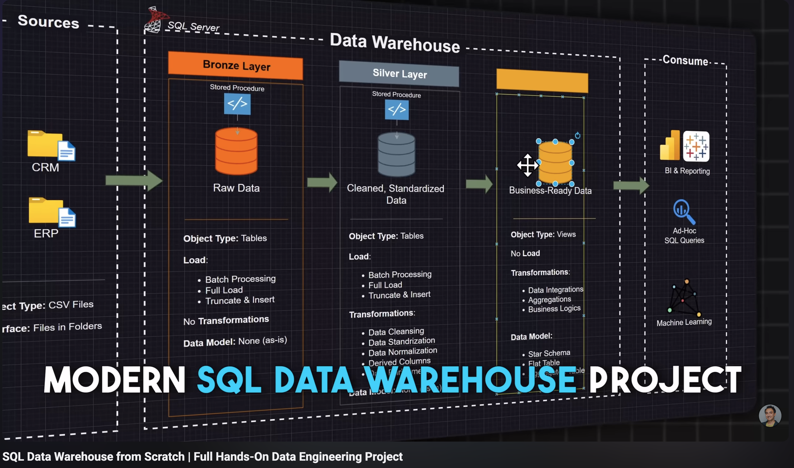

# 4 Data Projects That Will Actually Get You Hired in 2027
## Introduction

Hey there code mate 👋

There are only **4 months left** before the year ends. Start preparing for 2027 now by locking in. Let us lock in.

Here is the deal. Choose **2 projects** from this list and promise yourself to complete them and add them to your CV or portfolio before December 31. You just have to do it. This is for your future self, the one who wants to walk into 2027 with a portfolio that actually opens doors instead of getting ghosted.

Start with just **1 hour a day**. Split it into two 30 minute sessions if you have to. Morning coffee session and evening wind down session. That is it. Consistency beats intensity every single time.

Let us get into it.

---

## 1. Hands on Projects with EDA, AB Testing & Business Intelligence
**By freeCodeCamp** : [**Youtube Tutorial:** ](https://youtu.be/FTpmwX94_Yo?si=gVPYDxy8igeHTBJ-)

### What you will learn and build:

* **Exploratory Data Analysis (EDA) on real business data** using pandas, numpy and visualisation libraries. You will learn how to actually *interrogate* a dataset instead of just running `.describe()` and hoping for the best.
* **A/B testing from scratch**, the exact skill product and marketing teams pay for. You will learn hypothesis testing, statistical significance, and how to write up findings the way a business stakeholder can actually read them.
* **Business intelligence dashboards** that translate numbers into decisions. This is what separates a data analyst from someone who just writes code.

### How to make it portfolio worthy:
Do not just follow along. Pick a different dataset (Kaggle has thousands), apply the same techniques, and write a Medium article or LinkedIn post explaining your findings. That article becomes proof you can *think*, not just *type*.

---

## 2. End to End Data Engineering Project using Databricks
**By codebasics**: [**Youtube Tutorial:** ](https://youtu.be/U6ZUKWdfSLY?si=CUZAPgRN1RPUGd5l)

### What you will learn and build:
* **The full data engineering pipeline** from raw data ingestion to a clean analytics ready layer, using Databricks (the tool that shows up in almost every senior data role posting in the EU right now).
* **The Medallion architecture** (Bronze, Silver, Gold layers). This is industry standard vocabulary that will make your CV instantly recognisable to hiring managers.
* **PySpark for large scale data transformation**, plus how to schedule and orchestrate jobs. If you have only ever worked with pandas on CSV files, this is the level up your portfolio needs.

### How to make it portfolio worthy:
Use the free Databricks Community Edition. Document every layer of your pipeline in your README with screenshots. Recruiters skim GitHub, they do not read every file, so **your README is your handshake**.

---

## 3. SQL Data Warehouse from Scratch
**By Data With Baraa** : [**Youtube Tutorial:** ](https://youtu.be/9GVqKuTVANE?si=ogHLDgB_HP6JC0VU)

### What you will learn and build:
* **A full data warehouse from zero**, including designing schemas, writing ETL scripts, and building fact and dimension tables. This is the exact architecture used inside 90 percent of companies with a data team.
* **Advanced SQL** (window functions, CTEs, stored procedures, indexing). If SQL was ever the thing that scared you in interviews, this project will make it your strongest weapon.
* **Data modelling** using the star schema and snowflake schema approaches. Being able to *design* data instead of just querying it is a huge signal to employers that you think like an engineer.

### How to make it portfolio worthy:
Add an entity relationship diagram (ERD) to your README. Free tools like dbdiagram.io or drawSQL make this a 20 minute job. It looks incredibly professional and takes almost no extra effort.

---

## 4. Intro to SQL Project | Data Engineer Portfolio Project
**By Data With Baraa** : [**Youtube Tutorial:** ](https://youtu.be/YX9d7Q7MN9M?si=IjdZ-UIEOehFG_eF)

### What you will learn and build:
* **A complete end to end SQL portfolio project** you can drop straight onto your CV. Perfect starter if the Data Warehouse project above feels like too much for week one.
* **How to structure a data project professionally**, from raw data to cleaned tables to analytical queries that answer real business questions. This is the muscle every entry level data role tests for.
* **How to write SQL that solves problems**, not SQL that just runs. There is a huge difference, and this project trains you to think in terms of "what question am I answering" before you type a single `SELECT`.

### How to make it portfolio worthy:
At the end, write 5 business questions your queries answer (things like "which product drove the most revenue in Q3") and post the answers as a mini case study on LinkedIn. Tag it #datacareer. Watch what happens.

---

## 5. Bonus Pick: Build Something Uniquely Yours
Here is the honest truth. Recruiters see the same 3 tutorial projects on every junior CV. If you really want to stand out in 2027, take one of the four projects above and **apply it to a topic you actually care about**.

Love football? Build a data warehouse of your favourite league. Love fitness? Do EDA on your Strava or gym data. Love music? A/B test which Spotify playlist genres get the most saves.

The technical skill is exactly the same. But the story you tell in the interview goes from *"I followed a tutorial"* to *"I was curious about X, so I built Y."*

That is the version of you that gets hired.

---

## Your Action Plan Before December 31

* Pick **2 projects** from this list (not 5, not 3, just 2)
* Block **1 hour daily** on your calendar. Non negotiable.
* Create a fresh GitHub repo for each with a proper README
* Post your progress publicly (LinkedIn, X, or here) every Friday
* By New Year's Eve, add both to your CV and LinkedIn featured section

You are not too late. You are exactly on time. Lock in.

---

### Save this. Share this with a code mate who needs it.

Follow **@codewithboi** for more content that actually moves your career forward. No fluff, no gatekeeping, just the stuff I wish someone had shown me earlier.

`// @codewithboi`
