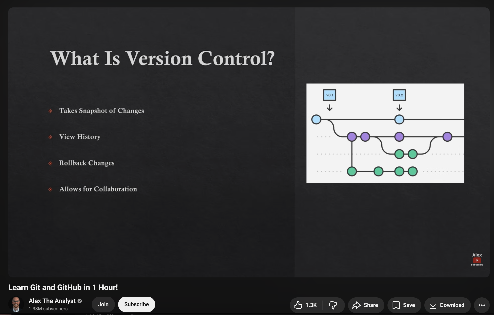
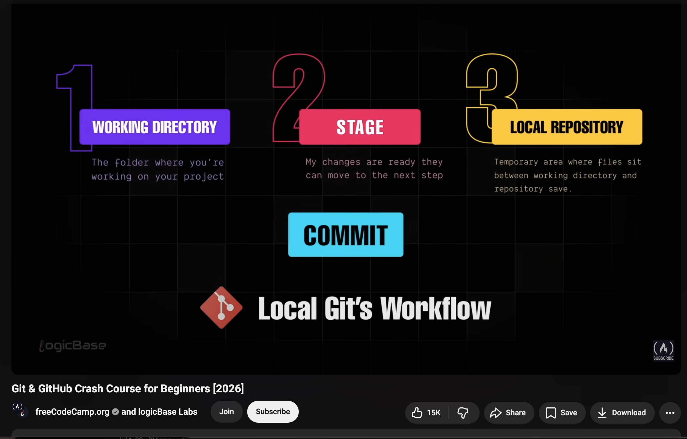
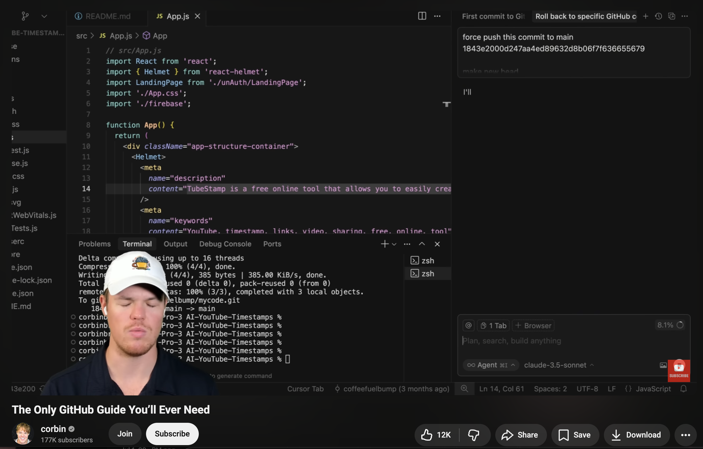
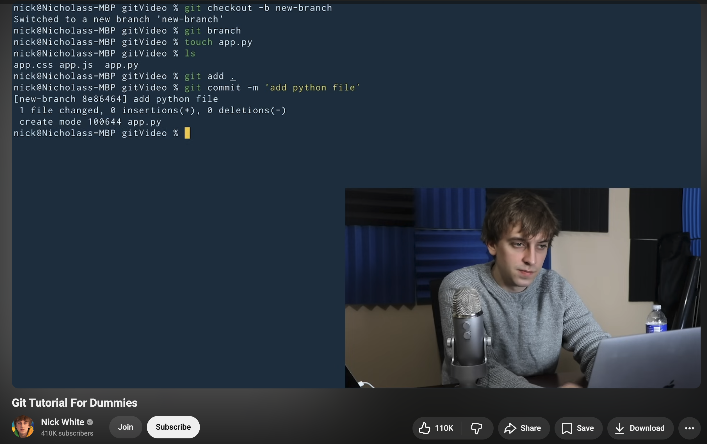
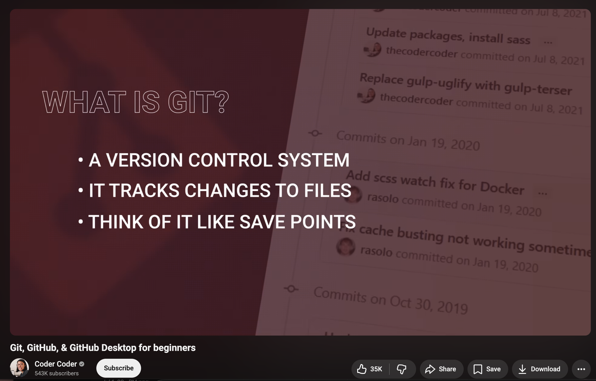

# Git & GitHub Resource Guide
###### Created by Boi for @codewithboi 
### The Best YouTube Channels to Learn Git Version Control (Beginner to Advanced)

This guide brings together five high-quality YouTube resources that will help you build strong Git fundamentals and progress toward real-world collaborative workflows.

### What You Will Learn

<table>
<tr>

<td valign="top" width="33%">

### Git Fundamentals

- What Git is
- Installing Git
- Creating repositories
- Commits
- Branches
- Merging
- Git history
- Undoing changes

</td>

<td valign="top" width="33%">

### GitHub Workflows

- Remote repositories
- Clone
- Push
- Pull
- Pull Requests
- Forking
- Collaboration
- GitHub Desktop

</td>

<td valign="top" width="33%">

### Professional Development

- Version control best practices
- Team collaboration
- Conflict resolution
- Branching strategies
- Portfolio management
- Open source contributions

</td>

</tr>
</table>

### 1. Learn Git and GitHub in 1 Hour: by Alex The Analyst

[**YouTube Link**](https://www.youtube.com/watch?v=lLoJHifWTRw&t=80s)

Provides an excellent introduction to Git and GitHub using practical examples that are easy to follow. It is designed for complete beginners who want to start using version control immediately.

### What You Will Learn
- Git fundamentals
- Creating repositories
- Commit workflow
- Branches
- GitHub basics
- Repository management

### Why This Resource Is Valuable
The explanations are beginner-friendly and focused on practical skills rather than theory.

---

### 2. Git & GitHub Crash Course for Beginners (2026): by freeCodeCamp

**YouTube Link:**  https://www.youtube.com/watch?v=mAFoROnOfHs

A comprehensive introduction to Git and GitHub with an emphasis on collaborative development and professional workflows used by software teams.

#### What You Will Learn
- Local repositories
- Remote repositories
- Clone
- Push
- Pull
- Pull Requests
- Collaboration workflows
- Git best practices

#### Why This Resource Is Valuable
It bridges the gap between learning Git commands and understanding how developers collaborate on real software projects.

---

### 3. The Only GitHub Guide You'll Ever Need: by Corbin

**YouTube Link:** https://www.youtube.com/watch?v=pJYOG6klqj8

This guide focuses on becoming productive with GitHub itself, covering many of the tools and features developers use daily.

##### What You Will Learn
- GitHub interface
- Repository management
- Branch workflows
- Collaboration
- Pull Requests
- Issues
- Project organization

##### Why This Resource Is Valuable

It helps transform GitHub from simply a code hosting platform into an effective collaboration and project management tool.

---

### 4. Git Tutorial For Dummies: by Nick White

**YouTube Link:** https://www.youtube.com/watch?v=mJ-qvsxPHpY

An approachable introduction that explains Git concepts using clear language and practical demonstrations without assuming previous experience.

##### What You Will Learn
- Version control basics
- Repository creation
- Commits
- Branches
- Merging
- Everyday Git commands

##### Why This Resource Is Valuable

Excellent for beginners who want to understand *why* Git works before memorizing commands.

---

### 5. Git, GitHub & GitHub Desktop for Beginners: by Coder Coder

**YouTube Link:** https://www.youtube.com/watch?v=8Dd7KRpKeaE

A practical guide that introduces Git alongside GitHub Desktop, making version control more approachable for visual learners.

##### What You Will Learn
- GitHub Desktop
- Repository management
- Commits
- Branches
- Synchronizing projects
- Visual Git workflows

##### Why This Resource Is Valuable
Perfect for developers who prefer learning Git through graphical tools before transitioning to the command line.

---

# Practice Project

After completing these tutorials, create your own Git workflow:

Project Folder

↓

Initialize Git Repository

↓

Create Multiple Commits

↓

Create a Feature Branch

↓

Merge the Branch

↓

Push to GitHub

↓

Open a Pull Request

↓

Deploy Your Project

Completing this workflow will give you hands-on experience with the commands and collaboration patterns used by professional software teams.

---

# Final Advice

Learning Git is not about memorizing commands. It is about understanding how software evolves over time.

The best way to become confident with Git is to use it on every project you build. Commit your work regularly, experiment with branches, make mistakes, and learn how to recover from them. These habits will prepare you for collaborative development and make you a more effective programmer.

---

Created by **@codewithboi**

Helping developers learn through curated, practical resources.